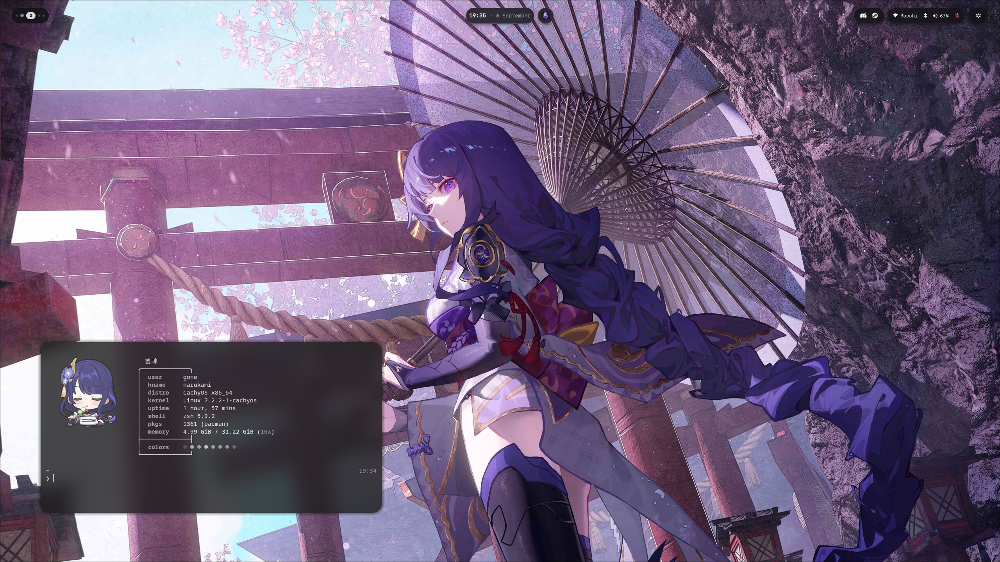

# dotfiles



```sh
git clone https://github.com/platanopp/dotfiles.git ~/dotfiles && cd ~/dotfiles && ./install.sh
```
Run `./install.sh --dry-run` first if you want to see what it would touch.

## Restoring

`install.sh` moves anything it would overwrite into
`~/.local/share/dotfiles-backups/<timestamp>/`, keeping the original paths, so
undoing a run is copying that tree back over `$HOME`.
